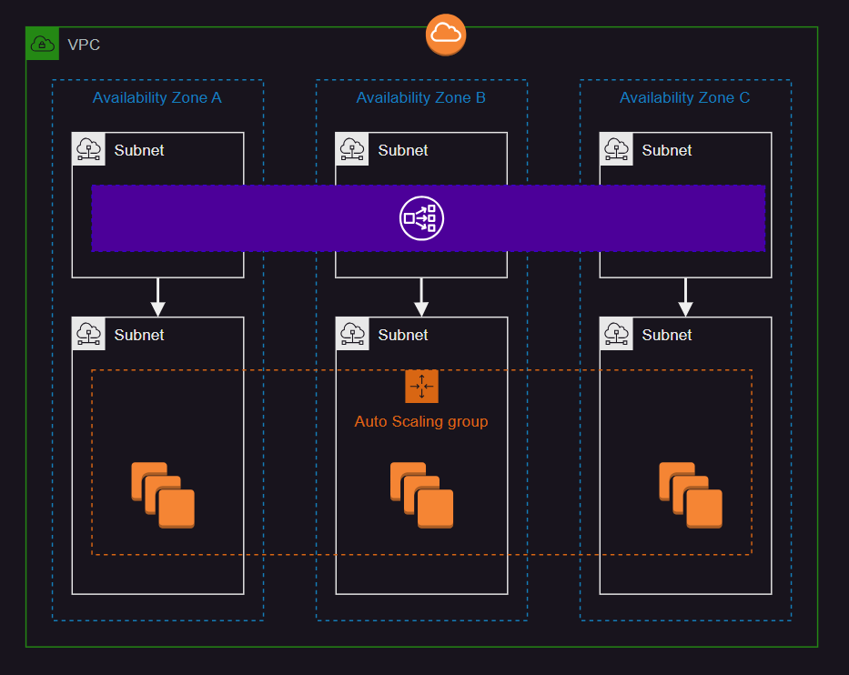

# AWS Network Load Balancer (NLB)

In order to create this infrastructure, verify the ACM certificate and also use a CNAME for the NLP matching the certificate domain.



This NLP implementation uses [ALPN][1]:

> Using ALPN policies, you can now offload your application’s TLS HTTP/2 traffic decryption/encryption to the Network Load Balancer, improving your service security posture and reducing operational complexity.

```
terraform init
terraform apply -auto-approve
```

NLB supports [TLS termination][2], allowing it to use either TLS or TCP target protocols, depending on the solution requirements.

[1]: https://aws.amazon.com/about-aws/whats-new/2020/05/network-load-balancer-now-supports-tls-alpn-policies/
[2]: https://aws.amazon.com/blogs/aws/new-tls-termination-for-network-load-balancers/
