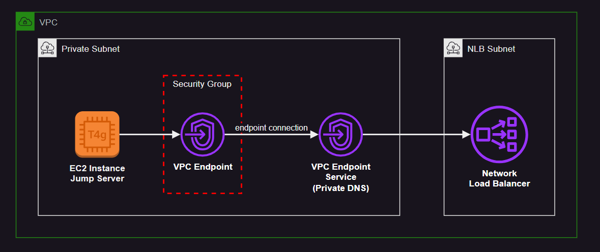

# AWS Network Load Balancer (NLB)

In order to create this infrastructure, verify the ACM certificate and also use a CNAME for the NLP matching the certificate domain.


This NLP implementation uses [ALPN][1]:

> Using ALPN policies, you can now offload your application’s TLS HTTP/2 traffic decryption/encryption to the Network Load Balancer, improving your service security posture and reducing operational complexity.

Additionally, this code will also provision a VPC Endpoint Service and a connected VPC Endpoint for private connection with the Network Load Balancer.



Create the resources:

```sh
terraform init
terraform apply -auto-approve
```

⚠️ The script is intended to fail when creating the VCP Endpoint. You'll need to verify the VPC Endpoint Service DNS prior to continuing.

To connect to the jump server from your local box:

```sh
aws ssm start-session --target i-00000000000000000
```

Additional information regarding NLBs:

- NLB supports [TLS termination][2], allowing it to use either `TLS` (forward the TLS) or `TCP` (terminates the TLS) target protocols, depending on the solution requirements.
- ALPN assists in the TLS negotiation to determine the protocol version.
- SNI allows and NLB listener to serve for multiple domains over TLS.

[1]: https://aws.amazon.com/about-aws/whats-new/2020/05/network-load-balancer-now-supports-tls-alpn-policies/
[2]: https://aws.amazon.com/blogs/aws/new-tls-termination-for-network-load-balancers/
